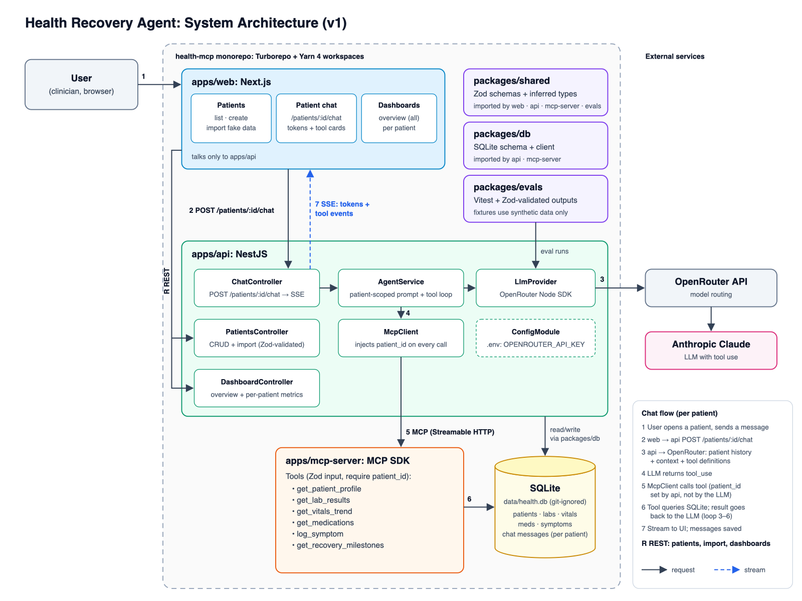

# health-mcp

An AI health-recovery assistant. Clinicians manage patients, review dashboards, and chat with an agent about one patient at a time. The agent answers by calling MCP tools that read that patient's health records.

> **Data policy:** this project is shared for learning purposes. Only synthetic or redacted data may be used. Real health data and API keys must never be committed. `data/`, `*.db` and `.env*` are git-ignored.

## Architecture



The editable source is [`docs/architecture.svg`](docs/architecture.svg).

### Components

| Workspace | Tech | Responsibility |
|---|---|---|
| `apps/web` | Next.js | **Patients**: list, create, import fake data. **Patient chat** (`/patients/:id/chat`): streams tokens and tool-call cards. **Dashboards**: an overview of all patients and a per-patient view. Talks only to `apps/api`. |
| `apps/api` | NestJS | REST endpoints for patients and dashboards. `POST /patients/:id/chat` streams the agent's reply over SSE. Runs the agent loop, calls the LLM through OpenRouter, and calls MCP tools. |
| `apps/mcp-server` | MCP TypeScript SDK | Standalone MCP server exposing patient-scoped health tools (labs, vitals, medications, symptoms, recovery milestones). |
| `packages/shared` | Zod | Schemas and inferred types shared by every app (API contracts, tool inputs). |
| `packages/db` | SQLite | Database schema and client used by `apps/api` and `apps/mcp-server`. Stores patients, health records and chat history per patient. |
| `packages/evals` | Zod + TypeScript | Eval cases and results for the agent. Fixtures use synthetic patients only. |

### Chat flow (per patient)

1. The user opens a patient and sends a message in `apps/web`.
2. The web app calls `POST /patients/:id/chat` on `apps/api`.
3. The agent sends the patient's chat history, patient context and tool definitions to the LLM via OpenRouter (Anthropic Claude).
4. The LLM responds with a tool call.
5. The api's MCP client calls the tool on `apps/mcp-server`. **The api sets `patient_id` on every call, not the LLM,** so a chat can only ever read its own patient's data.
6. The tool queries SQLite and the result goes back to the LLM. Steps 3–6 repeat until the LLM has a final answer.
7. Tokens and tool events stream back to the UI over SSE, and the messages are saved to the patient's chat history.

### Key decisions

- **Monorepo:** Turborepo + Yarn 4 workspaces (`nodeLinker: node-modules`).
- **Frontend / backend:** Next.js + NestJS.
- **MCP server:** a separate app, connected over MCP Streamable HTTP.
- **Database:** SQLite for v1 (local file at `data/health.db`).
- **LLM access:** OpenRouter Node.js SDK.
- **Validation and evals:** Zod + TypeScript. No Python in the repo.

## Repository layout

```
apps/                 (not created yet)
  web/                Next.js frontend
  api/                NestJS backend
  mcp-server/         MCP server
packages/
  shared/             Zod schemas + types
  db/                 SQLite config (schema + client to come)
  evals/              Eval case / result schemas
docs/
  architecture.png    Architecture diagram
  architecture.svg    Diagram source
```

## Status

The three packages exist as foundations: they build and type-check, but have no tests, database or data yet. The apps are not scaffolded yet. Work is tracked in Linear (LKLA-1).

## Getting started

Requirements: Node.js 24+ and any `yarn` command on your PATH (`npm i -g yarn`). The repo pins Yarn 4.18.1 in `.yarn/releases`, so whichever `yarn` you have will run that version.

```sh
yarn install
yarn build       # build all packages
yarn typecheck   # type-check all packages
```

Each package compiles to `dist/`. Apps import packages as `@health-mcp/<name>`.

### Environment variables

| Variable | Used by | Default |
|---|---|---|
| `DATABASE_PATH` | `packages/db` | `data/health.db` |
| `OPENROUTER_API_KEY` | `apps/api` (planned) | none; keep it in `.env`, never commit it |
